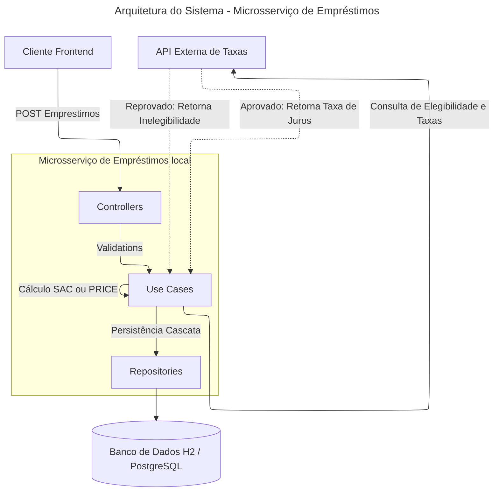

# Arquitetura do Sistema: Microsserviço de Empréstimos

## Diagrama da Arquitetura

O diagrama abaixo pode ser visualizado no VsCode com o plugin **Markdown Preview Mermaid Support** ou equivalente.

## Visão Geral

O microsserviço de "Gestão de Empréstimos" gerencia todo o modelo e o cálculo matemático referente as faturas e contratos. Ele utiliza integração via Microprofile REST Client para consultar a API externa de avaliação de crédito, que atua como avaliador de risco e fornecedora exclusiva das taxas de juros do sistema.

## Componentes Temporais do Fluxo

### 1. Separação de Domínios

- **Microsserviço de Empréstimos:** Concentra as regras locais de cadastro de contratos, efetuando o processamento do financiamento e faturamento, permitindo a persistência dos dados associados a um determinado ID de cliente.

- **Serviço Analítico Externo (Mock):** Atua como barreira de segurança financeira. Ele expõe a taxa de juros nominal em sua resposta. A transação da nossa API de cadastro do contrato de crédito deve abortar imediatamente se receber falha na comunicação ou reprovação pelo serviço parceiro.

### 2. Camadas da Aplicação (Layered Architecture)

- **Controllers (Camada Web):**

  - Expõem e coordenam os endpoints da aplicação.
  - Bloqueiam inconsistências de envio imediatamente pelo Framework (utilizando anotações Bean Validation no Request).
  - Encapsulam exceções padronizando saídas formatadas com um JSON simples através de implementações de ExceptionMapper.

- **Use Cases (Camada de Regras de Negócios):**

  - Comunicam de forma segura utilizando abstração RestClient do Microprofile para as rotas externas modeladas em `PROJETO_FINAL_taxas_api.yaml`.
  - Processam o array sequencial de Parcelas (Cálculos SAC/PRICE) e aplicam a base do juros referenciado localmente sobre o andamento e preenchimento cronológico.

- **Repositories (Camada de Acesso a Dados):**

  - Gerenciam todo a ponte relacional integrando persistência no disco persistindo num movimento transacional `Cascata` as parcelas recém calculadas originadas do Empréstimo pelo Hibernate ORM Panache.

### 3. Integração de Segurança Autenticada

- A implementação protege o acesso público contra roteamentos de dados sensíveis utilizando mecanismos base como os expostos nas integrações do Quarkus Security nas rotas cruciais, restringindo a inibição da regra por meio de `@RolesAllowed`.
